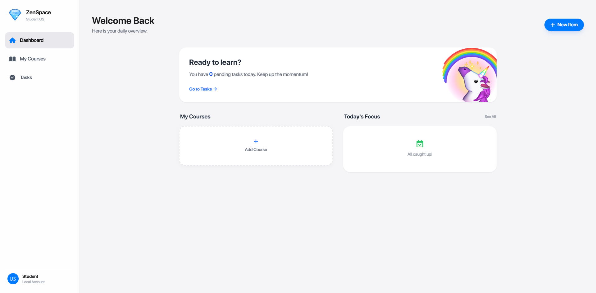

# 🎓 ZenSpace — Modern Open-Source Student LMS

**ZenSpace** is a clean, modern, and minimal **Learning Management System (LMS)** designed to help students organize courses, manage tasks, and stay focused — all in one beautiful dashboard.

> A Student-first OS with clarity, calm UI, and productivity in mind.

---

## 🚀 Live Demo

🔗 **Visit ZenSpace:**  
👉 [Live Demo](https://sadewdev.github.io/ZenSpace/)

---

## 📸 Screenshots

### 🧭 Student Dashboard

---

## ✨ Key Features

- 🎯 **Student-focused dashboard**
- 📚 Course management system
- ✅ Daily task tracking
- 🧠 “Today’s Focus” productivity section
- 🧼 **Clean & minimal UI**
- ⚡ Fast, lightweight & responsive
- 🌍 Open-source & customizable

---

## 🧠 Why ZenSpace?

Most LMS platforms are complex and overwhelming.  
**ZenSpace** focuses on:

- Simplicity
- Calm design
- Student productivity
- Zero distraction UI

Perfect for **students**, **developers**, and **educational startups**.

---

## 🛠️ Tech Stack

- **HTML5**
- **CSS3**
- **JavaScript (ES6+)**
- **Modern UI/UX principles**
- **Responsive design system**

*(Framework-agnostic & easy to extend)*

---

## 🎯 Future Improvements

🌙 Dark / Light mode toggle
📍 Auto-save Tasks.
📊 Focus Time Analyze.

---

## 🤝 Contributing

Contributions are welcome!
Feel free to fork, improve, and submit a pull request.

---

## 📜 Credits

- 💻 Developed by [Sadew Dev](https://github.com/sadewdev)

---

## ⭐ Show Your Support

If you like this project, don’t forget to:
⭐ Star this repository
🔁 Share it with others

